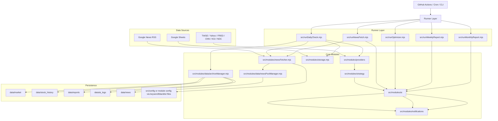

# InvestmentLineNotify 總體架構 / System Architecture

## 1. 系統定位
`InvestmentLineNotify` 是一套以 Node.js 為核心的投資決策與通知系統，主要服務 0050 / 00675L 與生命週期投資策略的日常監控、新聞治理、AI 分析與週期報告生成。系統採用 **file-based persistence + external services** 的設計，不使用傳統資料庫，而是以 `data/`、Google Sheets、Telegram、Langfuse 與多個市場資料來源共同構成執行基礎。

目前專案已不只是一條 `dailyCheck` 單線流程，而是由多個 runner 組成：

1. `src/runDailyCheck.mjs`：每日主流程。
2. `src/runNewsFetch.mjs`：獨立新聞抓取、去重、更新新聞池。
3. `src/runOptimizer.mjs`：獨立執行 blacklist / rule optimizer。
4. `src/runWeeklyReport.mjs`：讀取近期報告並生成 AI 週報。
5. `src/runMonthlyReport.mjs`：讀取近期報告並生成 AI 月報。

---

## 2. 生命週期總覽
系統實際運作可拆成五個層次：

1. **Entry Layer**：由 GitHub Actions、Cron 或手動 CLI 啟動各 runner。
2. **Data Collection Layer**：從 `src/modules/providers/`、Google News RSS、Google Sheets 抓取市場資料、帳戶狀態與新聞。
3. **Decision Layer**：由 `src/modules/strategy/` 與 `src/modules/ai/` 共同完成量化計算與 AI 判讀。
4. **Delivery Layer**：由 `src/modules/notifications/` 將結果轉為 Telegram HTML 訊息或週期報告。
5. **Persistence Layer**：透過 `data/`、Google Sheets 與 Langfuse 持久化報告、快取、觀測資料與新聞池。

---

## 3. Mermaid Flow



---

## 4. 目錄與責任對照

### `src/` 執行與模組層
| Path | 說明 |
|---|---|
| `src/dailyCheck.mjs` | 每日主 orchestration，串接持股繼承、資料抓取、策略計算、新聞摘要、AI 建議、通知、歸檔與條件式 `llmJudge`。 |
| `src/runDailyCheck.mjs` | CLI entry，處理參數如 `--telegram=false`、`--aiAdvisor=false`。 |
| `src/runNewsFetch.mjs` | 獨立新聞抓取流程，包含動態關鍵字產生、Yield Rate score 回寫、新聞池更新。 |
| `src/runOptimizer.mjs` | 獨立執行 Rule Optimizer，優化新聞治理規則。 |
| `src/runWeeklyReport.mjs` | 讀取近 7 天報告，最低 3 份才生成週報。 |
| `src/runMonthlyReport.mjs` | 讀取近 30 天報告，最低 10 份才生成月報。 |
| `src/modules/providers/` | 市場資料 provider layer，封裝 TWSE、Yahoo、FRED、CNN、KGI、NDC 等來源。 |
| `src/modules/strategy/` | 策略與風控核心，計算 RSI / KD / MACD、過熱、冷卻期與投資建議。 |
| `src/modules/ai/` | AI decision layer，包含 search query generation、news filter、macro analysis、investment coach、period report、rule optimizer、LLM judge。 |
| `src/modules/newsFetcher.mjs` | 新聞抓取與初步去噪主程式，負責整合靜態 / 動態關鍵字與 blacklist。 |
| `src/modules/keywordConfig.mjs` | 關鍵字與 blacklist loading 的設定入口，承接已完成的 keyword system 重構。 |
| `src/modules/data/newsPoolManager.mjs` | 新聞池 CRUD、TTL 清理、archive、fuzzy dedupe。 |
| `src/modules/notifications/` | 將決策結果輸出成 Telegram 訊息與週期報告格式。 |
| `src/modules/storage.mjs` | 與 Google Sheets 同步持股狀態與每日紀錄。 |
| `src/utils/` | 通用工具，例如 `TwDate`、timeout fetch、數值解析。 |

### `data/` 檔案持久化層
| Path | 說明 |
|---|---|
| `data/market/` | 總經與市場快取資料。 |
| `data/stock_history/` | 歷史股價快取。 |
| `data/reports/` | 每日決策最終報告，亦作為週報 / 月報輸入來源。 |
| `data/ai_logs/` | AI prompt / response 與治理相關紀錄。 |
| `data/news/pool_active.json` | 主新聞池，目前有效新聞。 |
| `data/news/pool_filtered_active.json` | 已整理後的新聞池版本。 |
| `data/news/archive/YYYY-MM-DD.json` | 過期新聞歸檔。 |

---

## 5. 已完成的架構演進（已整合自 `finish_features.md`）

### 5.1 Keyword System 重構
新聞關鍵字系統已從單純寫死字串，演進為結構化 `KeywordEntry`：

```ts
{
  keyword: string,
  searchType: "intitle" | "broad"
}
```

此設計帶來三層好處：
- 讓 RSS query 可區分「標題必含」與「廣泛匹配」。
- 讓靜態關鍵字池與 AI 動態關鍵字能共用同一 schema。
- 讓 AI Agent 後續調整關鍵字時，更容易定位 `keywordConfig`、`newsFetcher`、`prompts` 三個修改點。

### 5.2 News Filtering 變為雙層治理
目前新聞治理已分成兩層：

1. **RSS Query Layer**：在 `buildRssUrl()` 就把 `twExcludeKeywords` / `usExcludeKeywords` 轉成 `-keyword` 或 `-intitle:keyword`，先減少雜訊來源。
2. **Article Validation Layer**：抓回文章後，再用 blacklist regex、excluded sources 與標題規則做第二次過濾。

這個分層對 AI Agent 很重要：若之後要調整誤殺或漏網問題，必須先判斷是 query 層過濾過強，還是 article validation 層規則過嚴。

### 5.3 Runner 分流後的系統邊界更清楚
專案現在不再只依賴 `dailyCheck`。新聞抓取、規則治理、週報、月報都已有獨立 runner。這代表未來 AI Agent 在修改功能時，必須先確認問題屬於：
- daily execution pipeline，
- news governance pipeline，或
- period reporting pipeline。

這也是本次文件重整的核心目的：讓 Agent 能快速定位功能責任，不再把所有變更都誤集中到 `dailyCheck.mjs`。
