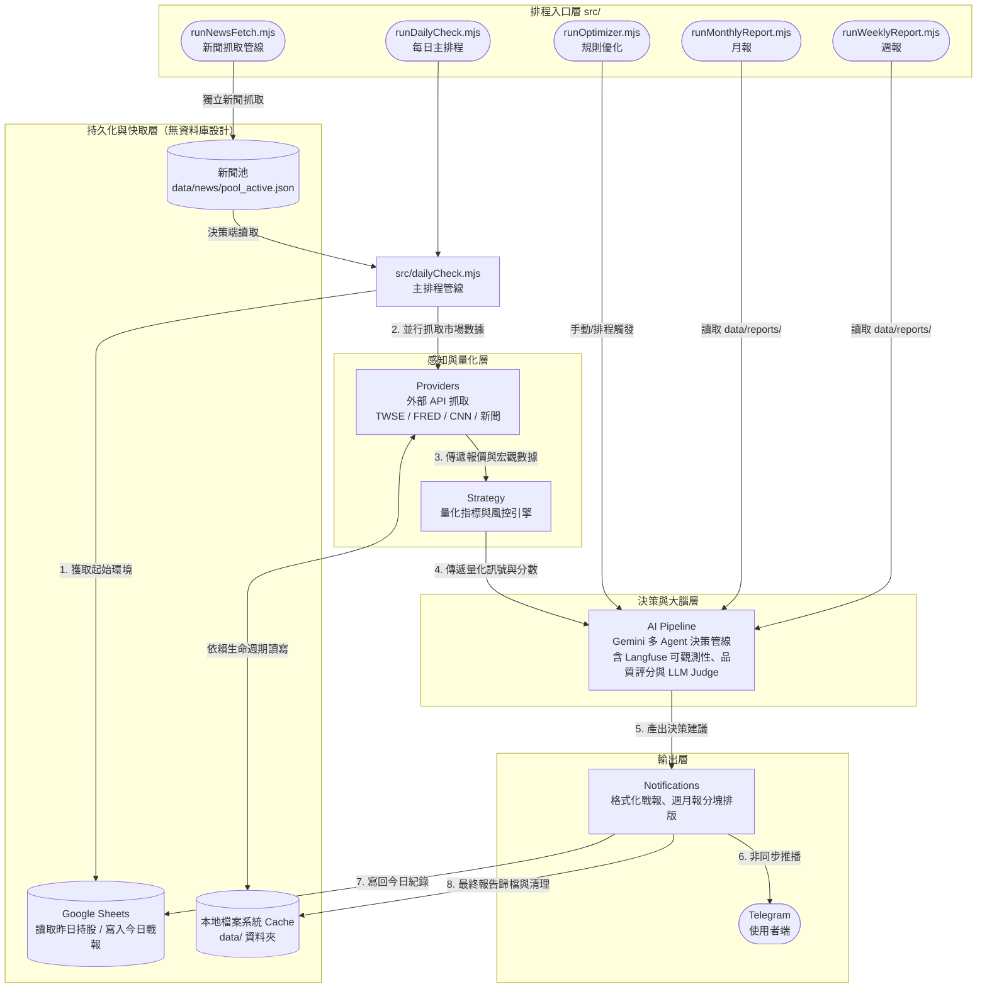

# 00675L 槓桿 ETF 投資決策系統 (InvestmentLineNotify) 總體架構

## 1. 系統總覽
本系統為一套專為「生命週期投資法」與 0050 / 00675L（槓桿 ETF）打造的**無資料庫（Serverless-like）Node.js 決策中樞**。

系統完整生命週期如下：
1. **排程觸發**：系統由外部 Cron Job（或 GitHub Actions）定時觸發各 Runner（`runDailyCheck`、`runNewsFetch`、`runWeeklyReport`、`runMonthlyReport`、`runOptimizer`），各自承擔不同的任務週期。
2. **狀態繼承**：透過讀取個人的 Google Sheets 獲取昨天的持股狀態與借貸金額。
3. **並行採集與快取**：跨網抓取台股/美股報價、各項總經指標（CNN 恐懼貪婪、國發會景氣、大盤融資）與財經新聞。為避免觸發 API Rate Limit，全面利用本地端 `data/` 資料夾進行快取與生命週期管理；新聞文章則另由 `newsPoolManager` 管理獨立的 24 小時滾動新聞池。
4. **量化與防護計算**：策略引擎轉換技術指標（RSI/MACD/KD），並加入嚴格的風控邏輯（如：維持率斷頭警告、乖離率過熱、冷卻期限制、極端恐慌破冰）。
5. **AI 大腦推演**：透過多金鑰輪詢呼叫 Google Gemini 模型，由四個串聯 Agent（新聞關鍵字產生器 → 雜訊過濾器 → 總經多空分析師 → 戰報洞察教練）執行完整 AI 決策管線，並由背景治理 Agent（規則優化器）持續維護新聞治理品質。全程透過 Langfuse 進行可觀測性追蹤與品質評分回寫，並由 LLM Judge 以條件式抽樣對戰報品質進行後驗評估。
6. **推播與歸檔**：將枯燥的 JSON 數據轉換為好讀的 Telegram 分段 HTML 戰報推播給使用者，最後將今日所有決策記錄寫回 Google Sheets，並把日誌歸檔於本地 `data/` 供日後覆盤。
7. **週期性覆盤**：每週/每月由獨立排程執行 `runWeeklyReport` / `runMonthlyReport`，讀取近期日報彙整統計，呼叫 AI 產生週期分析摘要並推播至 Telegram。

---

## 2. Mermaid 架構圖

以下的資料流呈現了系統中最重要的「單向決策管線」以及「本地 File System」取代資料庫的設計。

---

## 3. 核心資料夾對照表

### 程式碼邏輯 (`src/`)

#### Runner 入口層
| 檔案路徑 | 職責說明 |
| :--- | :--- |
| `src/runDailyCheck.mjs` | 每日主排程入口。接受 `--telegram=false`、`--aiAdvisor=false` 等 CLI 參數，用於本機測試時略過推播或 AI 呼叫。 |
| `src/dailyCheck.mjs` | 主排程核心邏輯。依序協調資料採集、量化計算、AI 決策、推播與歸檔，並於結尾條件觸發 LLM Judge。 |
| `src/runNewsFetch.mjs` | 獨立新聞抓取管線。呼叫 Search Queries Generator 產生動態關鍵字，批次抓取 RSS 後更新新聞池，並回寫 Langfuse Keyword Yield Rate score。 |
| `src/runWeeklyReport.mjs` | 週報 Runner。讀取最近 7 天的 `data/reports/` 日報（至少需 3 份），計算統計摘要並呼叫 AI 生成週期洞察後推播 Telegram。 |
| `src/runMonthlyReport.mjs` | 月報 Runner。讀取最近 30 天的 `data/reports/` 日報（至少需 10 份），計算含訊號品質的統計摘要並呼叫 AI 分析後推播 Telegram。 |
| `src/runOptimizer.mjs` | 規則優化 Runner。可由排程或手動觸發，執行 Rule Optimizer Agent 對 `blacklist.json` 進行候選規則分析與安全寫入。 |

#### 模組層 (`src/modules/`)
| 資料夾路徑 | 模組名稱 | 核心職責與重要檔案 |
| :--- | :--- | :--- |
| `src/modules/providers/` | **數據提供者** | 封裝第三方 API 的髒邏輯（如 TWSE 的 IPv6 解析跳過、CNN 的 Cookie 偽裝）。統一由 `marketData.mjs` 負責平行調度。 |
| `src/modules/strategy/` | **量化策略引擎** | 計算 TA-Lib 技術指標的 `indicators.mjs`，以及匯總維持率風險、乖離率過熱與冷卻期限制的決策中樞 `strategyEngine.mjs`。 |
| `src/modules/ai/` | **AI 決策管線** | 負責整個 AI 決策流程的結構化輸出、可觀測性（Observability）與規則自我修正（Governance）。`aiClient.mjs` 提供共用 Gemini 呼叫入口；`aiCoach.mjs` 串聯四個主決策 Agent；`prompts.mjs` 定義各 Agent 的 Prompt Schema；`aiDataPreprocessor.mjs` 負責數據降維；`llmJudge.mjs` 以條件式抽樣對戰報品質進行後驗評估；`periodReportAgent.mjs` 負責週/月報的統計彙整與 AI 分析。評分定義詳見 `docs/langfuse-score-configs.md`，各 Agent 說明詳見 `docs/modules/ai_pipeline.md`。 |
| `src/modules/notifications/` | **廣播與通知** | `notifier.mjs` 為對外發送入口；`templates/telegramHtmlBuilder.mjs` 格式化每日戰報為 3 段式 HTML；`templates/periodReportBuilder.mjs` 格式化週/月報；`transports/telegramClient.mjs` 負責實際 Telegram API 呼叫。 |
| `src/modules/data/` | **檔案資料庫管理** | `archiveManager.mjs` 提供讀寫 `data/` 資料夾的介面，具備自動清理 30 天過期檔案的機制；`newsPoolManager.mjs` 管理 24 小時滾動新聞池，包含 fuzzy 去重、TTL 歸檔、容量上限截斷與 Filtered Pool 儲存。 |
| `src/utils/` | **底層共用工具** | 提供全域的時間類別 `TwDate`、防呆解析器 `parseNumberOrNull` 以及處理 API 超時的防護殼 `fetchWithTimeout`。 |
| `src/modules/newsFetcher.mjs` | **新聞抓取核心** | 整合靜態關鍵字池與 AI 動態關鍵字，呼叫 Google News RSS，執行雙層過濾（RSS Query 層排除 + 文章 blacklist 層過濾），對接新聞池讀寫。 |

#### 設定層 (`src/config/`)
| 檔案路徑 | 說明 |
| :--- | :--- |
| `src/modules/keywordConfig.mjs` | 靜態關鍵字池（`baseTwQueries`、`baseUsQueries`、`twExcludeKeywords`、`usExcludeKeywords`）與 `loadBlacklist()` 動態黑名單讀取接口。 |
| `src/config/blacklist.json` | 新聞黑名單設定檔，包含 `titlePatterns`（regex 陣列）、`twExcludedSources`、`usExcludedSources`。由 seed 初始化，Rule Optimizer 通過安全閘門後動態追加。 |

---

### 本地持久化資料 (`data/`)
| 資料夾路徑 | 用途說明 | 讀寫頻率/特性 |
| :--- | :--- | :--- |
| `data/market/` | 總經指標與市場狀態的通用快取。 | 每日覆寫 `latest.json`，並按日期滾動備份至 `history/`。 |
| `data/stock_history/` | 台股個股歷史月報價的永久快取。 | 不變的歷史月份永久快取，僅抓取當前浮動月份。 |
| `data/reports/` | 每日排程執行完畢後的最終綜合報告（YYYY-MM-DD.json）。 | 每日排程最後一步寫入；保留最近 30 天；週/月報 Runner 讀取此目錄。 |
| `data/ai_logs/` | 傳送給 AI 的完整 Prompt 與原始 JSON Response，以及 Rule Optimizer 最新結果（`latest_RuleOptimizer.json`）。 | 飛行紀錄器，用於除錯；自動定時清理。 |
| `data/news/` | 新聞池相關檔案：`pool_active.json`（當前 24h 活躍池）、`pool_filtered_active.json`（AI 過濾後快取）、`archive/YYYY-MM-DD.json`（過期歸檔）。 | 由 `runNewsFetch` 寫入；`dailyCheck` 讀取；保留 30 天歸檔。 |
